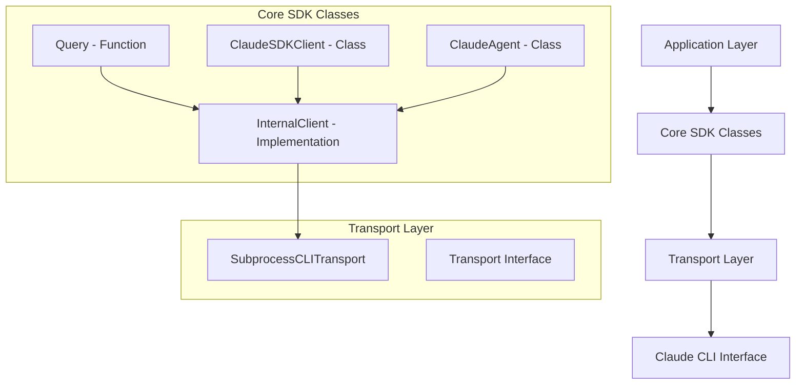

# Claude Agent SDK Architecture & Core APIs Research Report

**Executive Summary**

The Claude Agent SDK is Anthropic's official framework for building custom AI agent systems using Claude Code as the core runtime. The SDK provides programmatic access to Claude's capabilities through both CLI interfaces and Python/TypeScript packages, enabling developers to create autonomous agents that can read, write, edit files, execute commands, and integrate external tools through the Model Context Protocol (MCP).

## 1. Core SDK Classes and Architecture

### 1.1 Base Agent Classes



### 1.2 Key Classes and Their Purposes

#### **Query Function**
- **Purpose**: Simple, one-off interactions with Claude
- **Usage**: `async for message in query(prompt="...", options=...)`
- **Best for**: Stateless, single-turn interactions
- **Returns**: Async iterator of message objects

#### **ClaudeSDKClient**
- **Purpose**: Persistent client for continuous conversations
- **Features**:
  - Maintains conversation context
  - Supports streaming responses
  - Thread management across interactions
  - Tool approval callbacks

#### **ClaudeAgent**
- **Purpose**: High-level agent framework with built-in features
- **Features**:
  - Async context manager pattern
  - Built-in tool integration
  - Permission management
  - Configuration options

#### **InternalClient**
- **Purpose**: Implementation layer handling protocol communication
- **Responsibilities**:
  - Configuration validation
  - Message routing
  - Transport management
  - Hook execution

### 1.3 Message Type System

The SDK supports 5 core message types with hierarchical content blocks:

```mermaid
graph TB
    UserMessage --> User Content
    AssistantMessage --> ContentBlocks
    SystemMessage --> System Prompt
    ResultMessage --> Cost/Usage Data
    StreamEvent --> Partial Content

    ContentBlocks --> TextBlock
    ContentBlocks --> ThinkingBlock
    ContentBlocks --> ToolUseBlock
    ContentBlocks --> ToolResultBlock
```

#### Message Types:
1. **UserMessage**: User input/prompt
2. **AssistantMessage**: Claude's responses with content blocks
3. **SystemMessage**: System-level instructions
4. **ResultMessage**: Final results with cost/duration metadata
5. **StreamEvent**: Partial streaming responses

#### Content Blocks:
1. **TextBlock**: Plain text content
2. **ThinkingBlock**: Internal reasoning/thoughts
3. **ToolUseBlock**: Tool execution requests
4. **ToolResultBlock**: Tool execution results

## 2. Agent Creation Patterns

### 2.1 Query Pattern (Simple Interaction)

```python
import asyncio
from claude_agent_sdk import query

async def simple_query():
    async for message in query(prompt="What is 2 + 2?"):
        print(message)

asyncio.run(simple_query())
```

### 2.2 Persistent Client Pattern (Continuous Conversation)

```python
from claude_agent_sdk import ClaudeSDKClient

async def conversation_loop():
    async with ClaudeSDKClient(
        instructions="You are a helpful assistant",
        default_options={
            "model": "sonnet",
            "max_turns": 10
        }
    ) as client:
        while True:
            user_input = input("User: ")
            response = await client.run(user_input)
            print(f"Assistant: {response.text}")
```

### 2.3 Agent with Tools Pattern

```python
from claude_agent_sdk import ClaudeAgent
from typing import Annotated
from pydantic import Field

def get_weather(
    location: Annotated[str, Field(description="Location to get weather for")]
) -> str:
    """Get weather for a location"""
    return f"Weather in {location} is sunny"

async def agent_with_tools():
    async with ClaudeAgent(
        instructions="You are a helpful weather assistant",
        tools=[get_weather, "Read", "Write"]
    ) as agent:
        response = await agent.run("What's the weather like in Seattle?")
        print(response.text)
```

## 3. Lifecycle Hooks

The SDK supports 6 types of event hooks for fine-grained control:

### 3.1 Hook Types and Triggers

1. **SessionStart**: Before conversation begins
2. **UserPromptSubmit**: When user submits prompt
3. **PreToolUse**: Before tool execution
4. **PostToolUse**: After tool execution
5. **Stop**: When conversation stops
6. **Notification**: For user notifications

### 3.2 Hook Implementation Example

```json
{
  "hooks": {
    "UserPromptSubmit": [
      {
        "hooks": [
          {
            "type": "command",
            "command": "analyze_prompt.py"
          }
        ]
      }
    ],
    "PostToolUse": [
      {
        "hooks": [
          {
            "type": "command",
            "command": "log_tool_usage.sh"
          }
        ]
      }
    ]
  }
}
```

### 3.3 Practical Use Cases

- **Auto-activation of skills**: Analyze prompts and suggest relevant skills
- **Tool usage tracking**: Log all tool executions for auditing
- **Cost monitoring**: Track API usage and costs
- **Pre/post processing**: Clean up or validate tool inputs/outputs

## 4. Message Passing Patterns

### 4.1 Streaming Pattern

```python
async def streaming_response():
    async with ClaudeAgent(
        instructions="You are a helpful assistant"
    ) as agent:
        print("Agent: ", end="", flush=True)
        async for chunk in agent.run_stream("Tell me a short story"):
            if chunk.text:
                print(chunk.text, end="", flush=True)
        print()
```

### 4.2 Thread Management Pattern

```python
async def multi_turn_conversation():
    async with ClaudeAgent(
        instructions="You are a helpful assistant. Keep answers short."
    ) as agent:
        # First interaction
        response1 = await agent.run("What is Python?")

        # Continue in same thread
        response2 = await agent.run("What about JavaScript?")

        # Response maintains context from previous turns
```

### 4.3 Structured Output Pattern

```python
response = await agent.run(
    "Extract function names from auth.py",
    output_format="json",
    json_schema={
        "type": "object",
        "properties": {
            "functions": {
                "type": "array",
                "items": {"type": "string"}
            }
        }
    }
)
structured_output = response.structured_output
```

## 5. Orchestration Primitives

### 5.1 Subagents

Specialized agents for specific tasks with isolated contexts:

```python
async def subagent_example():
    async with ClaudeAgent(
        instructions="You are a code expert",
        allowed_tools=["Read", "Edit", "Bash"],
        name="CodeReviewer"
    ) as code_agent:

        async with ClaudeAgent(
            instructions="You are a documentation expert",
            allowed_tools=["Read", "Write"],
            name="DocWriter"
        ) as doc_agent:

            # Parallel execution
            code_task = code_agent.run("Review auth.py")
            doc_task = doc_agent.run("Generate API docs")

            results = await asyncio.gather(code_task, doc_task)
```

### 5.2 Tool Integration

Built-in tools available as strings:
- `"Read"`: Read file contents
- `"Write"`: Write file contents
- `"Edit"`: Edit files (multi-line)
- `"Bash"`: Execute shell commands
- `"WebFetch"`: Fetch web content
- `"Glob"`: File pattern matching
- `"Grep"`: Search file contents

### 5.3 MCP Server Integration

```python
# Example MCP server for custom tools
class MCPToolServer:
    async def list_resources(self):
        return ["custom_database", "file_system"]

    async def read_resource(self, name: str):
        if name == "custom_database":
            return await get_database_data()
        elif name == "file_system":
            return await list_files()

# Configure agent to use MCP server
async with ClaudeAgent(
    instructions="...",
    tools=["custom_database", "file_system"]
) as agent:
    response = await agent.run("Query the database")
```

## 6. Advanced Features

### 6.1 Permission Modes

- **default**: Standard permission checking
- **accept**: Automatically approve tools
- **plan**: Enter plan mode before tool use
- **bypass**: Bypass all permission checks

### 6.2 Cost Tracking

Built-in cost monitoring with:
- Real-time cost tracking
- Usage statistics (tokens, turns)
- Budget limits
- Cost analysis per operation

### 6.3 Context Management

- **Token estimation**: Pre-estimate context usage
- **Compression**: Automatic message summarization
- **Budget tracking**: Monitor and enforce token limits

## 7. Code Examples

### 7.1 Complete Agent Implementation

```python
import asyncio
from claude_agent_sdk import ClaudeAgent, ClaudeAgentOptions

async def complete_agent_example():
    options = ClaudeAgentOptions(
        instructions="You are a software development assistant",
        default_options={
            "model": "claude-sonnet-4-20250514",
            "permission_mode": "default",
            "max_turns": 20,
            "allowed_tools": ["Read", "Edit", "Bash", "Grep"]
        },
        hooks={
            "SessionStart": [
                {
                    "hooks": [
                        {
                            "type": "command",
                            "command": "setup_environment.sh"
                        }
                    ]
                }
            ]
        }
    )

    async with ClaudeAgent(options) as agent:
        response = await agent.run(
            "Fix the bug in user authentication module. "
            "First, analyze the code, then propose a fix."
        )

        # Handle response
        if hasattr(response, 'content'):
            for block in response.content:
                if hasattr(block, 'text'):
                    print(block.text)
```

### 7.2 Error Handling Pattern

```python
async def robust_agent_interaction():
    try:
        async with ClaudeAgent(
            instructions="You are a helpful assistant"
        ) as agent:
            response = await agent.run(
                "Process large dataset with error handling"
            )

            # Process response
            if isinstance(response, ResultMessage):
                print(f"Operation cost: ${response.total_cost_usd}")

    except Exception as e:
        print(f"Agent error: {e}")
        # Fallback or retry logic
```

## 8. Best Practices

### 8.1 Architecture Patterns

1. **Modular Skills**: Keep skills under 500 lines with separate resource files
2. **Progressive Disclosure**: Load main skill first, resources only when needed
3. **Context Engineering**: Design effective prompt patterns and context flows
4. **Error Boundaries**: Implement proper error handling and recovery

### 8.2 Performance Optimization

1. **Streaming**: Use streaming for better UX and early processing
2. **Parallel Execution**: Use subagents for independent tasks
3. **Tool Caching**: Cache tool results when appropriate
4. **Context Limits**: Monitor and manage token usage

### 8.3 Security Considerations

1. **Permission Modes**: Use appropriate permission levels
2. **Input Validation**: Validate all tool inputs
3. **Sandbox Execution**: Use sandboxed bash execution when possible
4. **Audit Logging**: Log all tool usage for security review

## 9. References

1. [Claude Agent SDK Official Documentation](https://platform.claude.com/docs/en/agent-sdk/overview)
2. [Anthropic Skills Repository](https://github.com/anthropics/skills)
3. [Claude Code GitHub](https://github.com/anthropics/claude-code)
4. [Claude Agent SDK Python Tutorial](https://tsinghua.blog.csdn.net/article/details/156567609)
5. [Microsoft Agent Framework Integration](https://learn.microsoft.com/zh-cn/agent-framework/user-guide/agents/agent-types/claude-agent-sdk)
6. [Claude Code CLI Usage](https://blog.csdn.net/elesos/article/details/157515993)

## 10. Unresolved Questions

1. **Official TypeScript SDK Documentation**: Limited public documentation for TypeScript package
2. **Advanced MCP Integration**: Complex MCP server configuration patterns not well documented
3. **Performance Benchmarks**: Limited performance data for large-scale deployments
4. **Enterprise Features**: Advanced enterprise deployment patterns and security configurations
5. **Migration Guides**: Detailed migration paths between different SDK versions

---

*Report generated by sdk-core-researcher-v2 on 2026-02-19*